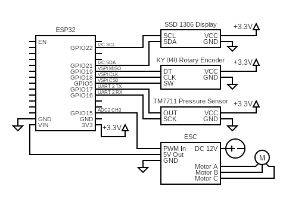

# OpenPAP

A fork of OpenPAP (original [here](https://github.com/keredson/openpap)), an open hardware, open source CPAP / BiPAP solution than can be build for about **$120**.

## Changes from original project
I wanted to make this machine more end-user friendly. To that end, I've utilized a rotary encoder interface to allow the user to configure the machine via a menu system. Currently the menu system supports the following:
* Starting/stopping the therapy cycle (therapy cycle now shows a graph)
* Testing the motor with manual throttle control
* Testing the pressure sensor
* Calibrating the ESC
* Auto tuning the PID parameters system using IMC

I have removed the OTA firmware updates / PID parameter changes for the time being.

## Disclaimer

**WARNING: This project is not approved for medical use.**

This project is provided **as-is**, **without any guarantees** or **warranties of any kind**, express or implied. It is an **experimental, educational, and non-commercial** open-source project intended to explore the design and functionality of CPAP systems.

By using, modifying, or building this project, you acknowledge and agree to the following:

- This project is **not certified** by any regulatory authority (e.g. FDA, CE, ISO).
- It is **not intended to diagnose, treat, cure, or prevent any disease**.
- It **must not be used as a substitute** for a commercially approved CPAP or BiPAP device.
- **Use at your own risk**. The creators and contributors are **not responsible for any harm, injury, or loss** resulting from the use or misuse of this hardware, firmware, or software.
- This device has **not undergone clinical testing** or safety validation.
- No support or liability is implied or offered for any applications of this project in **real-world medical or therapeutic contexts**.

If you are in need of CPAP therapy or respiratory assistance, please consult a qualified medical professional and use approved commercial devices.

## Current Status

This is a WIP, although from my testing, the firmware is in a working state.

## Hardware
- Resmed motor ([example](https://www.amazon.com/gp/product/B0CHYMMM8G))
- 5A 12v to 24v power supply (higher voltages support higher pressures - [example 12v](https://www.amazon.com/gp/product/B08C594VNP) / [example 24v](https://www.amazon.com/ALITOVE-100-240V-Adapter-Converter-5-5x2-1mm/dp/B01GC6VS8I))
- 4S to 6S ESC (brushless motor driver, depending on voltage - [example](https://www.amazon.com/RC-Brushless-Electric-Controller-bullet/dp/B071GRSFBD))
- ESP32 microcontroller ([example](https://www.amazon.com/ESP-WROOM-32-Development-Microcontroller-Integrated-Compatible/dp/B08D5ZD528))
- Air pressure sensor ([example](https://www.amazon.com/gp/product/B09V5BDFF6))
- KY 040 Rotary encoder ([example](https://www.amazon.com/JTAREA-KY-040-Encoder-Encoders-Modules/dp/B0D2TTG858))
- SSD1306 OLED 128x64 Display ([example](https://www.amazon.com/Hosyond-Display-Self-Luminous-Compatible-Raspberry/dp/B09T6SJBV5))
- XT60 Female Bullet Connector to DC5.5X 2.1mm Female Adapter ([example](https://www.amazon.com/cablecc-5-5x2-1mm-Quadcopter-Multicopter-Aeromodelling/dp/B0DLT9P7JK))
- (Optional, for testing) Breadboard
- (Optional, for testing) Jumper wires

## Build Guide

### Wiring

1. Flash firmware onto ESP32. The structure of this project is best suited for PlatformIO, but you can move all files from subfolders of `lib/` and the `.ino` file from `src/` to a folder called `openpap/`, and Arduino IDE should recognize that as a valid project.

2. It's recommended that you wire everything up on a breadboard to test the components. See above diagram for wiring. Unplug the USB cable from the ESP32, and wire up the rest of the components, but don't connect the ESC to the power supply. **The ESP32 should not be connected to USB while the hot wire from the ESC is connected to Vin of the ESP32**.

#### Wiring notes:
- **ESP32 Board:** This guide uses a **30-pin ESP32 DevKit**. If you're using a different variant, you can keep the same GPIO numbers, but be sure to consult a pinout diagram to locate the correct physical pins on your board.
- **Pin Flexibility:** You *can* use different GPIO pins than those listed, but you’ll need to update the `.ino` file before flashing the firmware. Not all GPIOs are suitable for I/O — check your ESP32 documentation first.
- **Powering the Device:** As the diagram shows, the ESC is powered by **12V DC from the power supply**. The ESC powers the motor. The ESC has a BEC connector that contains a **5V+ output line** that powers the ESC32 **through the `VIN` pin**. The ESC32 powers all other components via its **3.3V+ output pin**.
- ⚠️ **Power Warning:** You will need to connect the ESP to USB while flashing firmware and testing. **Do not connect the ESC's 5V wire to the ESP32's `VIN` pin while the ESP32 is also connected to USB.** This can cause voltage backfeeding, which risks damaging your computer, USB port, or the ESP32.
- **Powering the Components while Testing:** While testing, the ESP32 can be powered from USB while the ESC and motor are powered from the power supply, by *disconnecting* the ESC from the `VIN` pin, connecting the ESP32 to USB, and connecting the power supply to the ESC. The system will function in this configuration, while allowing the ESP32 to receive firmware updates and/or send messages to the serial monitor.
- **Motor Wiring Order:** The three motor wires can be connected in **any order**. If the motor spins the wrong direction, simply **swap any two wires**.
- **Motor Connector Tip:** The recommended ESC uses **female 3.5mm bullet connectors**, while the ResMed blower uses a **Molex Mini-Fit Jr.** connector. Instead of using an adapter, I cut off the Molex and soldered on **3 male bullet connectors** to match the ESC.
- **ESC Receiver Wires:** For the recommended ESC, the 3 wires that attach to the ESP32 are color-coded instead of labeled. Black is ground, red is +5V DC, and white is the signal wire for PWM control.
- **Static Electricity Warning:** Exercise caution when handling electronic components. A static discharge from your skin can damage sensitive electronics. Avoid touching the circuitry or embedded components by holding components by the edges of their breakout boards.

### Setup

Once the firmware is flashed and the components are wired up, it's time to set up the system and begin testing.

1. Power on the system, and wait for the menu to appear.
1. Move the rotary encoder, and ensure that you are able to navigate the menu.
1. Select "Settings" and press the rotary encoder button.
1. Select "Calibrations"
1. Select "Cal. Speed Control" and follow the instructions.
1. After finishing the ESC calibration, select "Settings" again from the main menu
1. Select "Test Components"
1. Select "Test Motor" 
1. Turn the dial to the right to increase the motor speed. Ensure the motor is responding to the various speeds.
1. Exit the motor test mode
1. Select "Test Press. Sensor"
1. Ensure the pressure sensor is responding to stimuli. Blow lightly on the pressure sensor nozzle and see if the reading jumps.
1. The "Calibrate CPAP" cycle should be run only after mounting the motor in the shell with the pressure sensor and hose attached.
